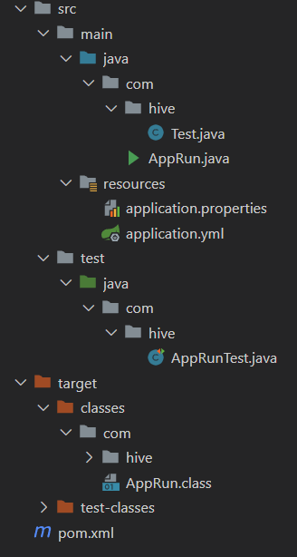

## 简介/intro

此插件是引用了 [JetBrains Icons](https://jetbrains.design/intellij/resources/icons_list/)，加上自定义。forked 自[brennondenny/vsc-jetbrains-icons-enhanced](https://github.com/brennondenny/vsc-jetbrains-icons-enhanced)

---

This Plugin is a collection of [JetBrains Icons](https://jetbrains.design/intellij/resources/icons_list/) with custom edits and additions. Forked from [brennondenny/vsc-jetbrains-icons-enhanced](https://github.com/brennondenny/vsc-jetbrains-icons-enhanced)

## 项目结构/Project Structure

**插件也有对SpringBoot项目的优化：**仅是AppRun.java和AppRunTest.java有定制图标。

**注意**：由于vscode无法识别接口和抽象类，所有java后缀的文件都是同一个图标。

---

**This Plugin also has some optimizations for the springboot project:** Only the AppRun.java and AppRunTest.java files have custom icons, otherwise it is the default java icon.

**Pay attention**：Since vscode does not recognize interfaces and abstract classes, all java suffix files are the same icon

## 图标/Icons

---

All JetBrains Icons can be found
[here](https://jetbrains.design/intellij/resources/icons_list/).
